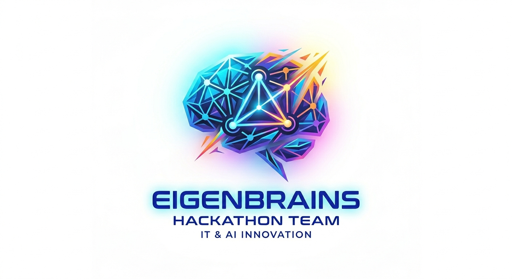

# 🧠 EigenBrains: HackAI 2026 — ShifA'I

**Theme: AI for the Rural World**

ShifA'I is a multimodal AI triage agent that empowers rural Moroccan nurses by processing spoken Darija consultations and medical imagery to generate structured diagnostic reports and automatically escalate critical emergencies to urban specialists.

<p align="center">
  
</p>

---

## 🎯 Project Overview

Rural dispensaries in Morocco are staffed by nurses who often lack specialist support. **ShifA'I** bridges this gap by acting as an AI-powered co-pilot: it listens to the live Darija conversation between nurse and patient, transcribes and understands it, analyzes uploaded medical images (X-rays, ultrasounds), and produces a structured PDF triage report — escalating emergencies to urban doctors automatically.

### Core Workflow

| Step | Node | Description |
|------|------|-------------|
| 1 | **Audio Intake** | Captures and transcribes live Darija speech via Whisper / Groq-accelerated ASR |
| 2 | **Extraction** | LLM extracts symptoms, history, and chief complaint from the transcript |
| 3 | **Clinical Reasoning** | MedGemma identifies potential pathologies and red flags |
| 4 | **Visual Diagnostic** | Gemini / MedGemma-V analyzes Chest X-ray or Ultrasound for anomalies |
| 5 | **Artifact Generation** | Synthesizes findings into a structured, readable PDF report |
| 6 | **Emergency Routing** | Flags URGENT cases and routes full context to a city specialist |

---

## 🛠️ Tech Stack

| Layer | Tool |
|-------|------|
| **Agentic Orchestration** | LangGraph + LangChain |
| **Fast LLM Inference** | Groq API |
| **Medical Reasoning & Vision** | Google AI Studio — MedGemma / Gemini |
| **Speech-to-Text** | Whisper (Groq-accelerated) |
| **Model Hub** | Hugging Face |
| **Experiment Tracking** | Weights & Biases (W&B) |

---

## 🗺️ Development Roadmap

- **Phase 1 — Core Orchestration:** Define `TriageState` (`TypedDict`) and LangGraph skeleton that passes data between nodes.
- **Phase 2 — Linguistic Front-End:** Whisper ASR + Darija-to-structured-concepts extraction node.
- **Phase 3 — Medical Brain:** `clinical_reasoning_node` powered by MedGemma for pathology detection and red-flag identification.
- **Phase 4 — Visual Diagnostic:** `image_analysis_node` integrating MedGemma-V / Gemini for radiology interpretation.
- **Phase 5 — Escalation & Artifacts:** Emergency detection logic, automated PDF generation, and specialist routing.

---

## 🚀 Quickstart Guide for the Team

1. **Clone the repo:** `git clone https://github.com/Ismailea4/EigenBrains-HackAI-2026`
2. **Set up virtual environment:** `python -m venv venv`
3. **Activate it:** `source venv/bin/activate` (Mac/Linux) or `venv\Scripts\activate` (Windows)
4. **Install dependencies:** `pip install -r requirements.txt`
5. **API Keys:** Copy `.env.example` to a new file named `.env` and add your API keys. **DO NOT COMMIT YOUR `.env` FILE.**

## 📂 Repository Structure

```
/notebook   → Jupyter notebooks for API testing and rapid prototyping
/src        → Production-ready agent code and LangGraph architecture
/docs       → Product spec, roadmap, and hackathon guidelines
/assets     → Logos and visual assets
```

## 📝 Progress Checklist

- [x] Define core problem statement (ShifA'I — AI triage for rural Moroccan dispensaries)
- [ ] Verify API access for all team members (`notebook/API_Tools_Quickstart.ipynb`)
- [ ] Implement `TriageState` schema and LangGraph skeleton (Phase 1)
- [ ] Integrate Groq ASR + Darija extraction node (Phase 2)
- [ ] Set up MedGemma clinical reasoning node (Phase 3)
- [ ] Integrate vision model for medical image analysis (Phase 4)
- [ ] Build PDF artifact generation and emergency routing (Phase 5)

---

## 👥 Team

- [Ismail ELADRAOUI](https://github.com/Ismailea4)
- [Saâd QACIF](https://github.com/SaadQacif)
- [El Yazid TEBBAA](https://github.com/coderyaz856)